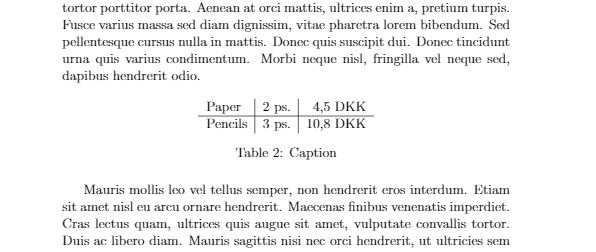

# LaTeX tips and tricks

## Contributions

This is meant as a LaTeX reference card. It is free to use, and I am accepting any type of useful contribution. If the reference card is missing something or something is not right, you are more than welcome to contribute to the project.

## Tabel of contents

* [Inserting an image](#Inserting-an-image)
* [Inserting a code listing](#Inserting-a-code-listing)
  * [From a file](#From-a-file)
  * [From text](#From-text)
* [Text formatting](#Text-formatting)
  * [Bold text](#Bold-text)
  * [Italics text](#Italics-text)
  * [Underlined text](#Underlined-text)
* [Citations](#Citations)
  * [Making labels](#Making-labels)
  * [Referencing using cleveref](#Referencing-using-cleveref)
* [Making labels](#Making-labels)
* [Math in LaTeX](#Math-in-LaTeX)
  * [Math, LaTeX and OCR](#Math,-LaTeX-and-OCR)
* [Tables in LaTeX](#Tables-in-LaTeX)

## Inserting an image

[To the top](#LaTeX-tips-and-tricks)

```latex
\begin{figure}
    \centering
    \includegraphics[width=1\textwidth]{path/to/figure.png}
    \caption{The caption that appears under the image}
    \label{fig:label_of_figure}
\end{figure}
```


## Inserting a code listing

[To the top](#LaTeX-tips-and-tricks)

Please note that this step requires you to have a `preamble.tex` with the following lines in it.

```latex
\usepackage{listings}
\usepackage{caption}
\DeclareCaptionFont{white}{\color{white}}
\DeclareCaptionFormat{listing}{\colorbox{gray}{\parbox{\textwidth}{#1#2#3}}}
\captionsetup[lstlisting]{format=listing,labelfont=white,textfont=white}

\lstdefinestyle{framed}
{
    frame=lrb,
    belowcaptionskip=-1pt,
    xleftmargin=8pt,
    framexleftmargin=8pt,
    framexrightmargin=5pt,
    framextopmargin=5pt,
    framexbottommargin=5pt,
    framesep=0pt,
    rulesep=0pt,
    autogobble,
    columns=fullflexible,
    showspaces=false,
    showtabs=false,
    breaklines=true,
    stepnumber=1,
    numbers=left,
    showstringspaces=false,
    breakatwhitespace=true,
    escapeinside={(*@}{@*)},
    commentstyle=\color{greencomments},
    keywordstyle=\color{bluekeywords},
    stringstyle=\color{redstrings},
    numberstyle=\color{graynumbers},
    basicstyle=\ttfamily\footnotesize,
    frame=shadowbox,
    tabsize=4,
    captionpos=b
}
```

#### From a file

[To the top](#LaTeX-tips-and-tricks)

```latex
\lstinputlisting[language=c, style=framed, label=code:label_for_code,caption=Caption of the file]{path/to/file.c}
```

#### From text

[To the top](#LaTeX-tips-and-tricks)

```latex
\begin{lstlisting}[language=c, style=framed, label=code:label_for_code,caption=Caption of the code]

#include <stdio.h>

/* This is a comment */

int main(void) {
    printf("Hello World!");
    return 0;
}

\end{lstlisting}
```


## Text formatting

[To the top](#LaTeX-tips-and-tricks)

The following formatting can all be mixed.

#### Bold text

```latex
\textbf{Your text here}
```

#### Italics text

```latex
\textit{Your text here}
```

#### Underlined text

```latex
\underline{Your text here}
```

## Citations

[To the top](#LaTeX-tips-and-tricks)

In order to use citations you must have a library to keep track of these. I recommend using the following line, in your preamble

```latex
\usepackage[backend=bibtex, bibencoding=utf8]{biblatex}
```

In order to link this to your `.bib` file, include it in your preamble using

```latex
\addbibresource{path/to/file.bib}
```

Here is an example of what a citation might look like in your .bib file

```bibtex
@BOOK{Mittelbach2005,
  author = {Frank Mittelbach},
  edition = {2. ed.},
  publisher = {Addison-Wesley},
  title = {The LATEX companion},
  year = 2005
}
```

Now in order to reference this citation anywhere in the code, you can use the following command

```latex
Lorem ipsum dolor sit amet, consectetur adipiscing elit, sed do eiusmod tempor
incididunt ut labore et dolore magna aliqua. \cite{Mittelbach2005}
```

In case you need to point out something that needs a citation, you can include the following, in your `preamble.tex` and call `\citationneeded` whereever you need a citation

```latex
\newcommand{\citationneeded}[1][]{\color{blue} [Citation needed]\color{black}}
```

## Making labels

[To the top](#LaTeX-tips-and-tricks)

Labels can be used to reference something in your document at a later time. Labels are created by doing

```latex
\label{type:name_of_label}
```

Assume we have created a label called `fig:example`. To reference this label, we type the following, in the document, where we want to reference it

```latex
\ref{fig:exmaple}
```

#### Referencing using cleveref

[To the top](#LaTeX-tips-and-tricks)

Referencing using the standard `\ref{}` can be quite annoying with typing all the `figure \ref{label}`. With cleveref this is all handled for you! Use the `cleveref` package to automate this.

```latex
\usepackage{cleveref}
```

To reference a figure, table or equation, you can now use `\cref{label}` which will write `fig. 0.0`, `eq. 0.0` or whatever the type is.

If you wish to change how you're referencing the appendix or anything else, you can do so in your preamble, by using the following command

```latex
\crefname{appendix}{Chapter}{Chapters}
```

Where the second parameter is the singular name, and the third parameter is the plural name.

## Math in LaTeX

[To the top](#LaTeX-tips-and-tricks)

In order to use equations and other mathematical expressions in LaTeX, you must first include the `amsmath`, `amssymb`, `units` and `SIUnits` packages

```latex
\usepackage{amsmath}
\usepackage{amssymb}
\usepackage[amssymb]{SIUnits}
\usepackage{units}
```

If you want to spice up your mathematical expressions, you can also include the `amsfonts` package.

To make an expression, do the following

```latex
\begin{equation}
    2^4=16
\end{equation}
```


#### Math, LaTeX and OCR

If you don't want to type in every single formula and equation, you can use the [mathpix OCR tool](https://mathpix.com) to convert an existing image to valid mathematical expressions formatted for LaTeX.

## Tables in LaTeX

[To the top](#LaTeX-tips-and-tricks)

To use nice looking tables in LaTeX, you must include the `tabularx`, `booktabs` and `array` packages

```latex
\usepackage{tabularx}
\usepackage{booktabs}
\usepackage{array}
```

The following example shows how a table might be set up

```latex
\begin{table}[H]
    \centering
    \begin{tabular}{l|c|r}
         Paper & 2 ps. & 4,5 DKK  \\\hline
         Pencils & 3 ps. & 10,8 DKK
    \end{tabular}
    \caption{Caption}
    \label{tab:my_label}
\end{table}
```



`{l|c|r}` describes how the text is aligned in the different cells.

*l* is Left side allignment.

*c* is center allignment.

*r* is right side allignment.

Every table entry is seperated by an `&` sign, and when you need to add a line seperator between the next row of cells, you use `\\\hline`. If you do not include the `\hline` your table will not have a line seperator.


